https://github.com/mermaid-js/mermaid

https://mermaid.js.org/syntax/flowchart.html

https://support.typora.io/Draw-Diagrams-With-Markdown/#flowcharts

---
### XY Chart 
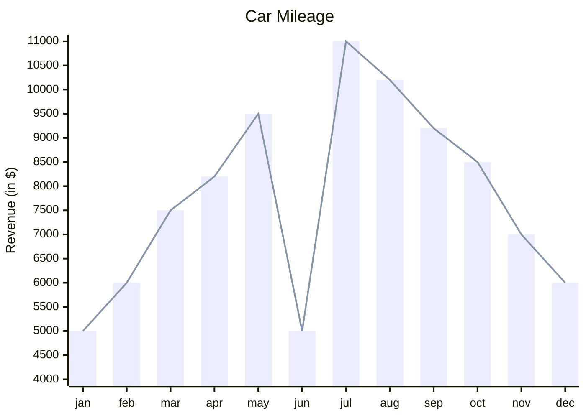
---
### Flow Chart 
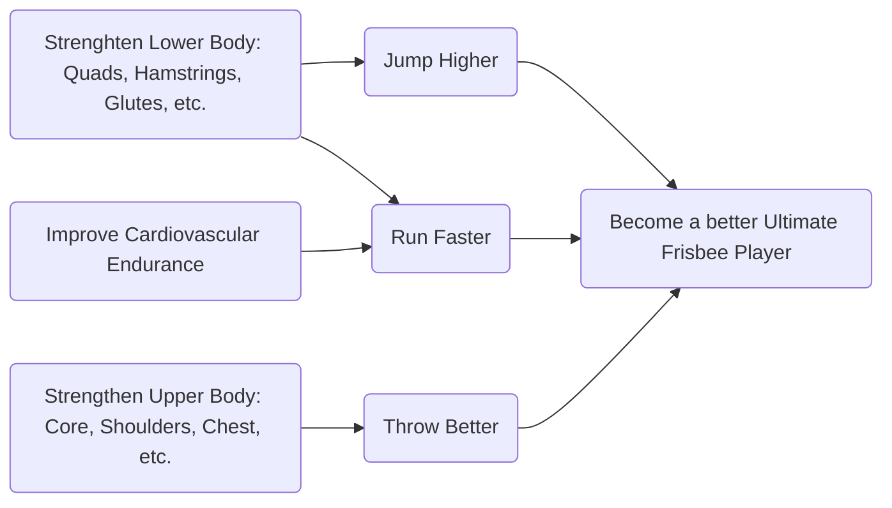

---
### Pie Chart 
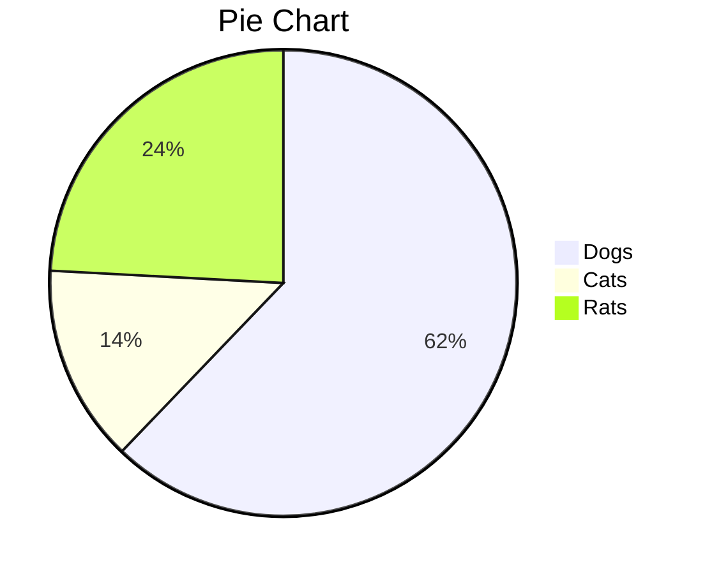

---
### Kanban 
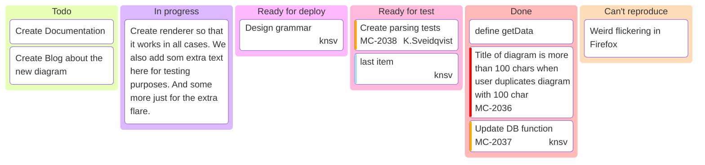

---
### Gantt Chart 
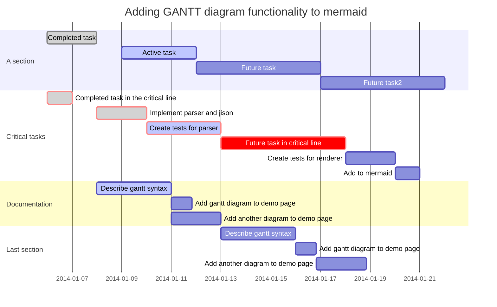

---
### Timeline
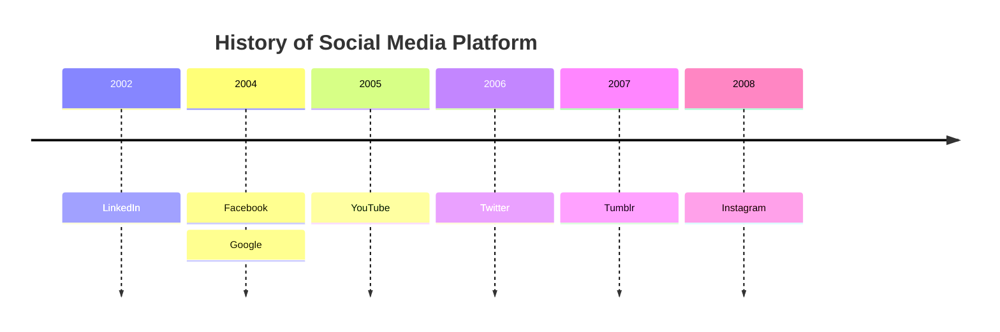

---
### Sankey
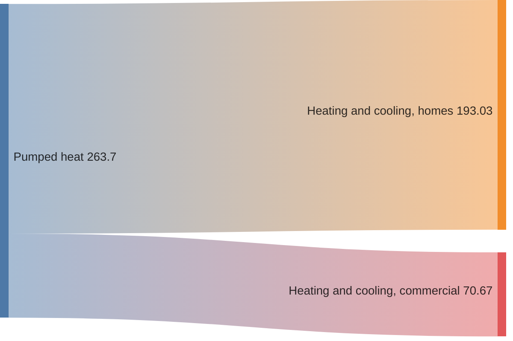

---
### Journey
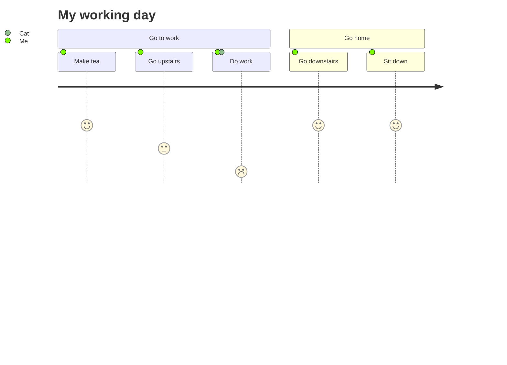

---
### Quadrant Chart
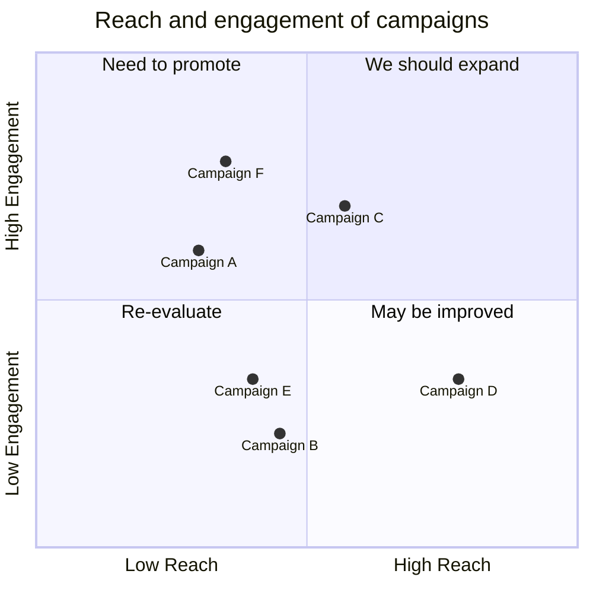
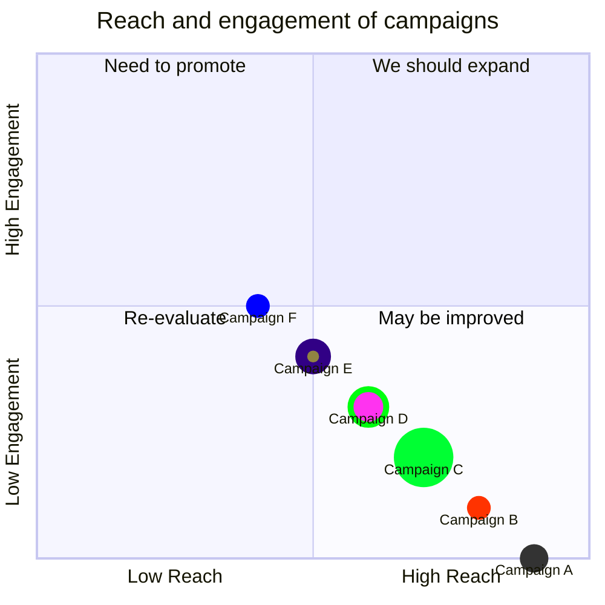

---
### Mindmap
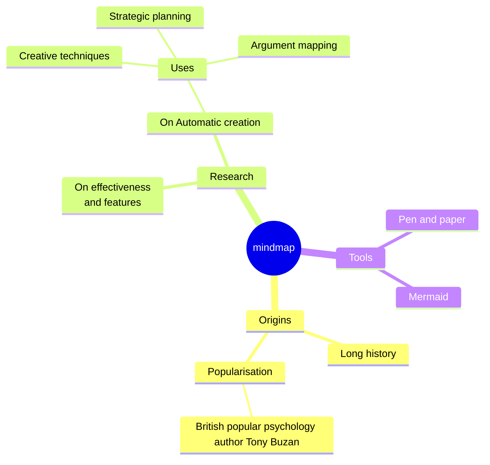

---
### Architecture
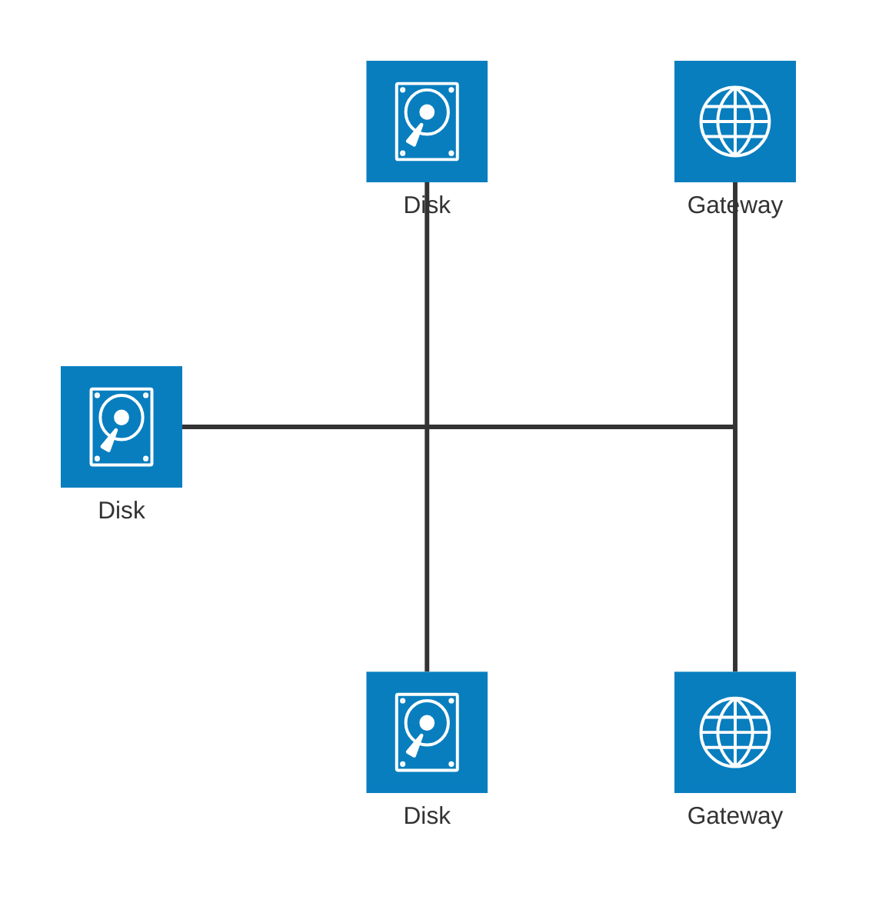
