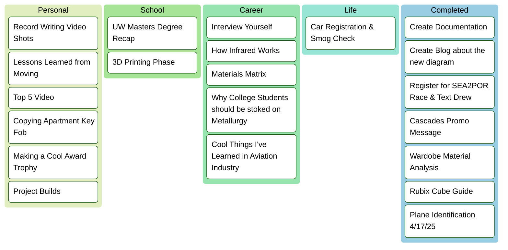
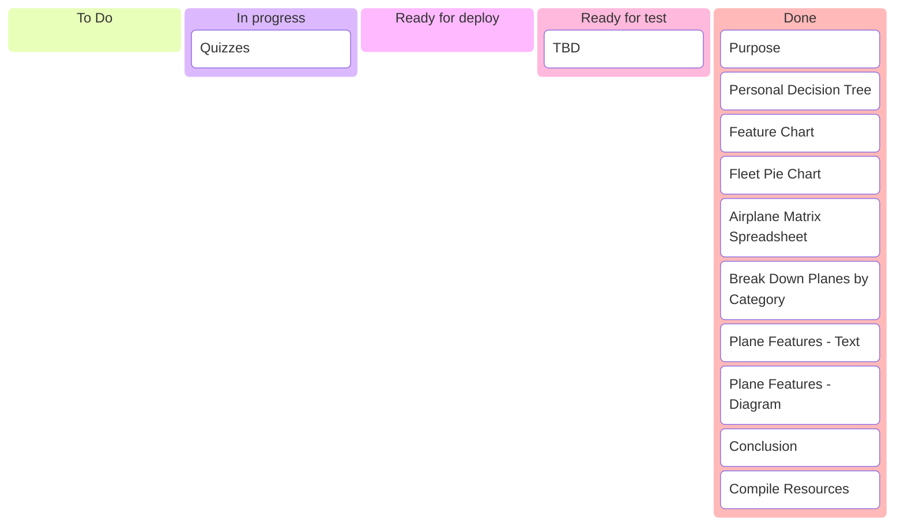
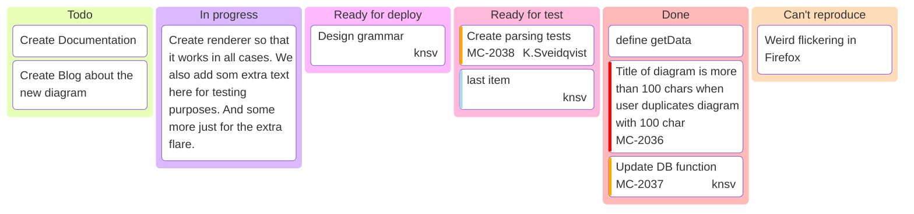

### Personal Dashboard
**`Organizing my life and tracking my project progress`**

---
### Interview Yourself
[Career Project Link](Resources/Career.md)
- Listen to podcasts for inspiration
- Create Important Questions & Script Dialouge

### Materials Matrix
[Materials Project Link](Resources/Engineering/Materials.md)
- Working on Presentation
- Working on Spreadsheet
- Consider making a video of presentation
- Consider Material Samples like Kirch

### Cool Award Trophy
[Project Builds Link](Resources/Engineering/ProjectBuilds.md)
- Switchback Award Necklaces
- Cascades Resin Award Trophy
- TBD

### Lessons Learned from Sports 
- Sometimes you can't choose your teammates
- Conflicts can stem from caring
- 

---
### Personal To Do List

### Save for Later
Site References:  
- Clothing Analysis
- Car Stuff
- Cooking Stuff
- 
- Engineering Builds

### Project: Airplane Identification Summary
[Project Link](https://github.com/Bailey-Wu/Bailey-Wu/blob/main/Portfolio/Airplane%20Identification.md)  
Due Date: 3/28/25 5PM  
Completion Date: 

---

