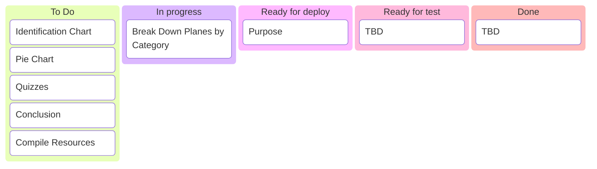
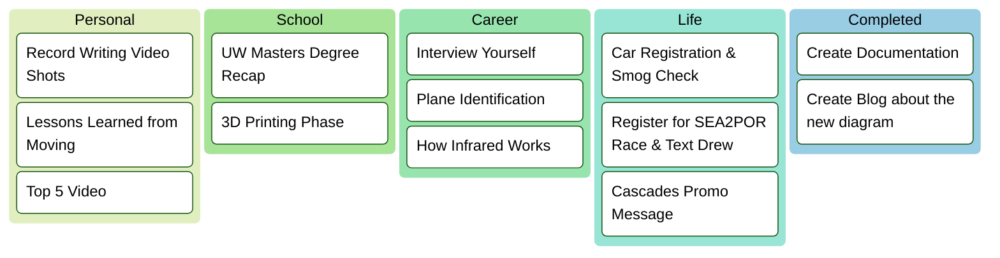
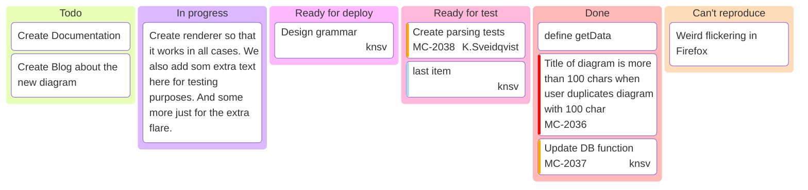

### Personal Dashboard
**`Organizing my life and tracking my project progress`**

---
### Project: Airplane Identification Summary
[Project Link](Portfolio/Airplane_Identification.md)

---
### Personal To Do List

---

