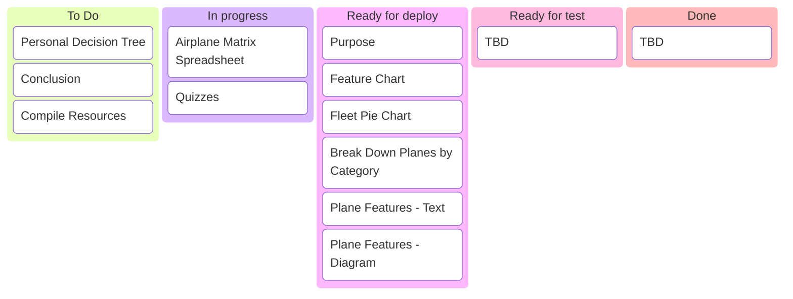
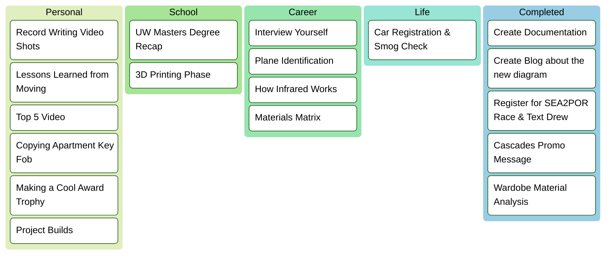

### Personal Dashboard
**`Organizing my life and tracking my project progress`**

---
### Project: Airplane Identification Summary
[Project Link](https://github.com/Bailey-Wu/Bailey-Wu/blob/main/Portfolio/Airplane%20Identification.md)
Due Date: 3/28/25 5PM

---
### Personal To Do List

### Save for Later
Site References:  
- Clothing Analysis
- Car Stuff
- Cooking Stuff
- 
- Engineering Builds

---

