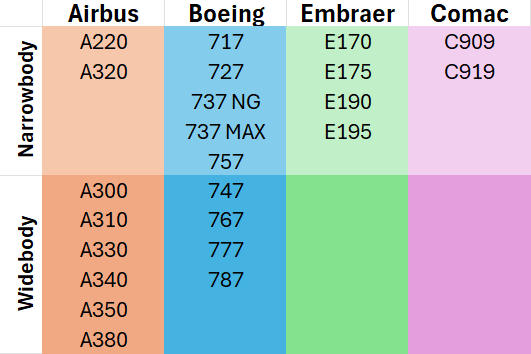
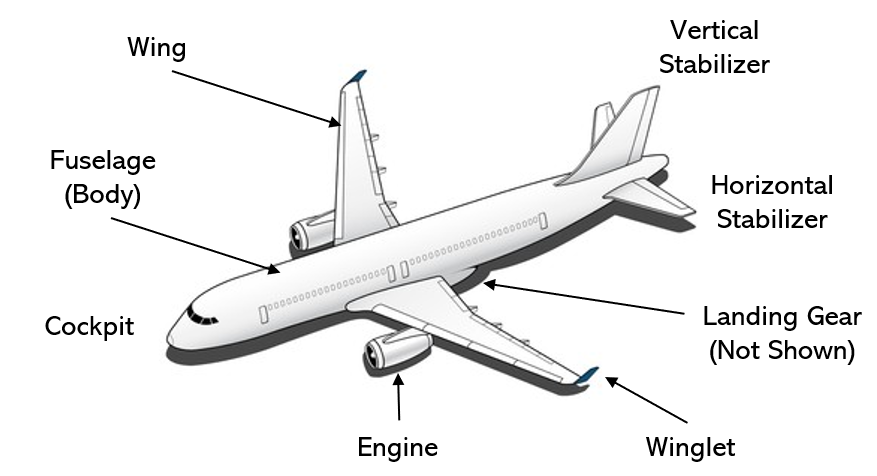
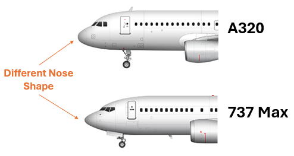
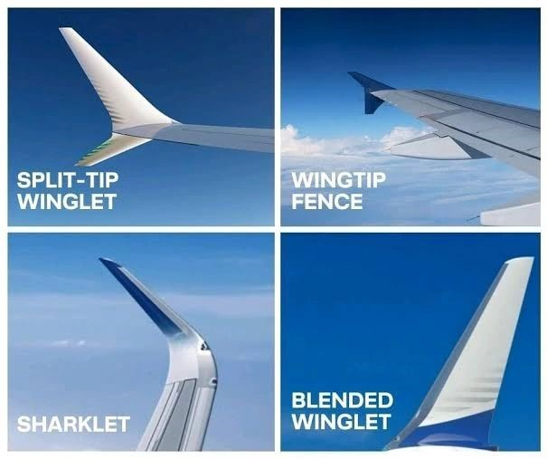
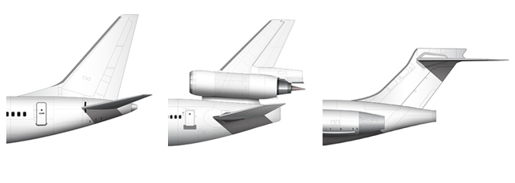
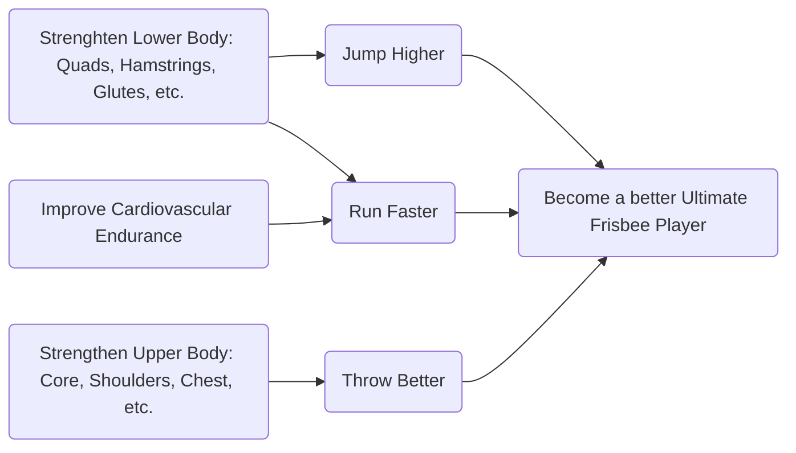

## Purpose ✈️
With the large variety of airliners serving the worldwide transportation market today, identification of individual aircraft manufacturers and planes can be a bit tricky. After spending some time working for an airplane manufacturer, I thought it’d be helpful to share some of the tricks I've learned and put together a quick guide to easily identify commercial airplanes.

## Categorizing Airplanes
There are tons of commercial airplanes in the sky, but to keep things simple, we’ll focus on just two types: Narrow-Body and Wide-Body jets.

Check out this table showcasing examples of each type of plane from Airbus, Boeing, and other manufacturers: 

## Features of an Airplane
To spot a specific plane, it’s important to get familiar with the terminology related to different airplane features.

Here is a link to learn more about additional airplane features.

## Distinct Features
Some airplanes have unique features that help distinguish them from others. Here are a few examples:

### Different Nose Shapes

### Winglet Shapes

### Empennage Shapes

### 787 Serrated Nacelle Covers 

### A350 "Zorro" Mask Window

Here is a spreadsheet in my best attempt to compile airplanes and their features 

## Fleet Analysis
Another way to identify a plane is by getting to know the fleets of different airliners, as each airline company has a diverse range of commercial aircraft that contribute to their fleet size.

This chart shows you which airlines prefer Airbus, which ones lean towards Boeing, and which have a balanced mix of both.

## My Personal Decision Tree
Here’s my decision tree for identifying airplanes

## Conclusion
The next time you're at an airport and curious about the airplanes around you, don’t hesitate to use this guide! With a little practice, you'll be able to spot different models and impress your friends with your knowledge. So grab your phone, keep an eye on the skies, and enjoy the fascinating world of aviation!

## :star2: Credit/Acknowledgment

## :ledger: Index

- [About](#beginner-about)
- [Motivation](#zap-defining-motivation)
- [Routine](#clock1-routine)
- [Equipment](#wrench-equipment)
- [Workout](#nut_and_bolt-workout)
- [Example Templates](#hammer-example-templates)
  - [Upper Body](#upper-body)
  - [Lower Body](#lower-body)
  - [Abs](#abs)
- [Alternatives](#alternatives)
- [Credit/Acknowledgment](#star2-creditacknowledgment)

##  :beginner: About
Disclaimer: I want to clarify that I am not a personal trainer. With the vast amount of information available on workout regimes, I often felt overwhelmed trying to determine my fitness goals and which exercises would be most beneficial for me. This is why I decided to create a personalized space to share my own experiences and insights, as they may resonate with others navigating similar challenges.

## :zap: Defining Motivation
The first important step I took was reflecting on my motivations for working out. I identified my main reasons for my fitness journey:
-  To run faster and jump higher, enabling me to compete at higher levels of Ultimate Frisbee
-  To build strength and reduce the risk of injuries
-  To cultivate healthy habits that will benefit me as I age

By clearly outlining my motivations, I was able to understand the underlying reasons for my workouts and create a comprehensive vision that would guide my fitness routine.

##  :clock1: Routine
The next step I took was to assess how I could incorporate working out into my daily life and how frequently I was committed to adding exercise into my schedule.

| Day       | Activity        |
|-----------|------------------|
| Monday    | Upper Body                  |
| Tuesday   | Frisbee / Cardio                 |
| Wednesday | Abs                 |
| Thursday  | Lower Body                 |
| Friday    | Recovery Day                 |
| Saturday  | Frisbee / Cardio                 |
| Sunday    | Floater                 |

I believe it's perfectly fine to adjust the plan when life events arise. However, creating this routine provided me with a clear understanding of how much time I was willing to commit to working out. Additionally, incorporating a "Floater" Day allowed me to shift my schedule as needed for any unexpected events.

##  :wrench: Equipment
The next step was to assess the workout equipment I had at my disposal: Did I have any home equipment? Access to a gym? Free weights? I ultimately decided to get a gym membership near my workplace, allowing me to go there after work and bypass the post-work traffic.

##  :nut_and_bolt: Workout
Once I established my time and equipment, I wanted to understand how I would structure my workouts. I decided to set two gym days: 1 for Upper Body and 1 for Lower Body. Then the Abs and Cardio days I can do at home or outside the gym. 

### :nut_and_bolt: Upper Body
Based on what I've found, a good upper body workout involves working the following muscle groups
-  Chest: 2 exercises
-  Back: 2 exercises
-  Shoulders: 1 exercise
-  Biceps: 1 exercise
-  Triceps: 1 exercise

###  :nut_and_bolt: Lower Body
-  Quads: 1-2 exercises
-  Hamstrings: 1-2 exercises
-  Glutes: 0-1 exercise
-  Calves: 1-2 exercises

## :hammer: Example Templates

### Upper Body
Warm Up: 
-  Resistance Band
-  Roll Out with Foam Roller
-  Dynamic Stretching on Pull-Up bar

| Muscle Group | Primary Activity                     | Secondary Activities |
|----------    |----------                            |----------|
| Chest #1     | Bench Press                          | Dumbbell Press   |
| Chest #2     | Lat Pull Down                        | Push-Ups   |
| Back #1      | Barbell Row                          | Pull Ups   |
| Back #2      | Single Arm Dumbbell Row              | Pull Ups   |
| Shoulder     | Seated Dumbbell Press                | Lateral Raise    |
| Biceps       | Dumbell Curls                        | Chin Ups   |
| Triceps      | Overhead Dumbbell Tricep Extension   | Seated Bench Dips   |

### Lower Body
Warm Up: 
-  Lateral Band Movement
-  Roll Out with Foam Roller
-  Dynamic Stretching

| Muscle Group | Primary Activity | Secondary Activities |
|----------    |----------|----------|
| Quads        | Squats   | Goblet squat   |
| Hamstrings   | Deadlifts   | Single-leg deadlift  |
| Glutes       | Leg Lunges  | Bulgarian split squat  |
| Calves       | Calf Raises  | N/A |
| Dynamic      | Vertical Jumps  | Broad Jumps |
| General      | Leg Machines  | N/A |

### Abs
-  [Workout Video 1: Fraser Wilson](https://www.youtube.com/watch?v=9p7-YC91Q74)
-  [Workout Video 2: Pamela Reif](https://www.youtube.com/watch?v=AnYl6Nk9GOA)
-  [Workout Video 3: Yoga with Adreinne](https://www.youtube.com/watch?v=CRKmB-78elI)
-  Dynamic Stretching

### Cardiovascular Endurance
-  Bike Ride
-  Ultimate Frisbee
-  Track Workout

### Alternatives
Build your own workout!

### Takeaway/Conclusion
Build your own workout!

### :star2: Credit/Acknowledgment
Credit the authors here.
- https://www.aworkoutroutine.com/upper-lower-split/
- https://www.strongerbyscience.com/neglected-movements-muscles/
- https://www.healthline.com/health/fitness/leg-workout#warmup-cooldown
- Build your own workout

##  :lock: License
Add a license here, or a link to it.

