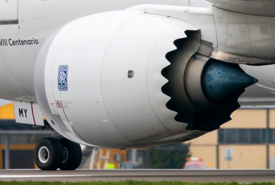

## Purpose ✈️
With the large variety of airliners serving the worldwide transportation market today, identification of individual aircraft manufacturers and planes can be a bit tricky. After spending some time working for an airplane manufacturer, I thought it’d be helpful to share some of the tricks I've learned and put together a quick guide to easily identify commercial airplanes.

## Categorizing Airplanes
There are tons of commercial airplanes in the sky, but to keep things simple, we’ll focus on just two types: Narrow-Body and Wide-Body jets.

Check out this table showcasing examples of each type of plane from Airbus, Boeing, and other manufacturers: 

## Features of an Airplane
To spot a specific plane, it’s important to get familiar with the terminology related to different airplane features.

[Link to learn more about additional airplane features.](https://www.flyaeroguard.com/learning-center/parts-of-an-airplane/)

## Distinct Features
Some airplanes have unique features that help distinguish them from others. Here are a few examples:

### Different Nose Shapes

### Winglet Shapes

### Empennage Shapes

### 787 Serrated Nacelle Covers 

### A350 "Zorro" Mask Window

### 737 Next Generation "Scimitar" Winglets

Here is a spreadsheet in my best attempt to compile airplanes and their features 

## Fleet Analysis
Another way to identify a plane is by getting to know the fleets of different airliners, as each airline company has a diverse range of commercial aircraft that contribute to their fleet size.

This chart shows you which airlines prefer Airbus, which ones lean towards Boeing, and which have a balanced mix of both.

## My Personal Decision Tree
Plane-spotting for beginners: https://form.typeform.com/to/CK7OwWgx

## Conclusion
The next time you're at an airport and curious about the airplanes around you, don’t hesitate to use this guide! With a little practice, you'll be able to spot different models and impress your friends with your knowledge. So grab your phone, keep an eye on the skies, and enjoy the fascinating world of aviation!

## :star2: Credit/Acknowledgment
  - https://suitesmile.com/blog/2019/12/27/plane-spotting-for-beginners/
