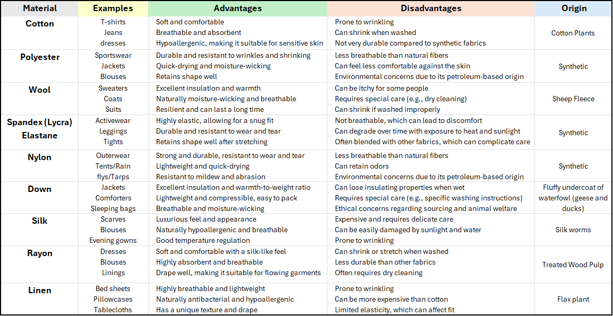

# What are my clothes made of?
Understanding the material that make up my wardrobe

## Different Types of Clothing Material

<b>Synthetic</b>  
Fabrics that are man-made materials made from chemicals derived from petroleum, coal, and natural gas. They are used in many products, including clothing, footwear, and accessories
  
-  Polyester: The most widely used synthetic fabric, making up about 60% of synthetic fibers
-  Acrylic: A soft, lightweight, and warm fabric that resembles wool
-  Nylon: A strong and stretchy fabric
-  Spandex: A fabric that stretches and recovers well
-  Olefin: A strong, rugged, and abrasion-resistant fabric
-  Microfiber: A soft, smooth, lightweight, and breathable fabric

## My Wardobe
- My Favorite Clothing
Kuhl Sun Hoodie, Patagonia Pants, BE Pivot Pants,

| Clothing       | Material        |
|-----------|------------------|
| Patagonia Pants    | 	100% Polyester                |
| BE Pivot Pants   | 90% Polyester, 10% Elastane |
| Darn Tough Socks | Merino Wool with Nylon and Lycra Spandex |
| Eddie Bauer Long Sleeve  | 93% Polyester, 7% Elastane                 |
| Friday    | Recovery Day                 |
| Saturday  | Frisbee / Cardio                 |
| Sunday    | Floater                 |

<b> Situational Clothing </b>  
- Playing Frisbee: Polyester
- Going Out Clothes:
- Rainy Day:
- Wedding: 

Pie Chart of Clothing by Body Part
- Upper Body
- Lower Body
- Feet
